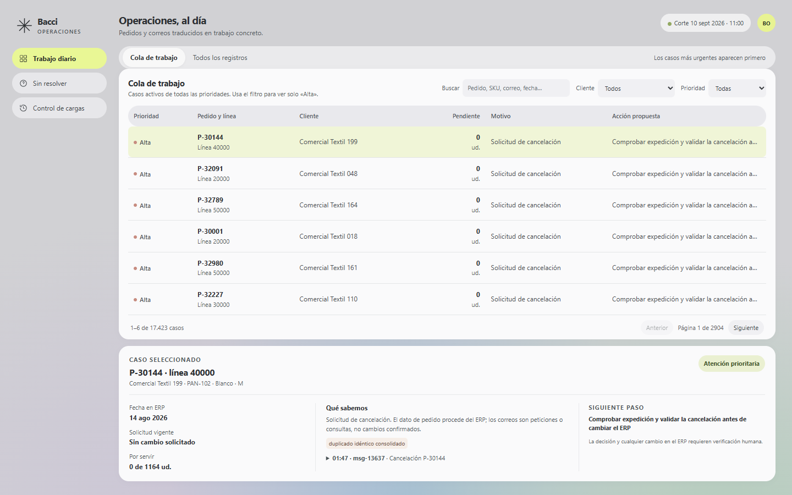

# Prueba de automatización

Del control de pedidos a la operación diaria

## El objetivo

Queremos conocer **cómo piensas, qué metodología sigues, cómo planteas un sistema y cómo presentas tus decisiones**.

Bacci suministra textil al *mass market*. Trabaja con un Navision antiguo, Excel y Outlook, y quiere modernizar su ERP en los próximos seis meses sin interrumpir la actividad.

Construye una **automatización y una aplicación sencilla** para que operaciones sepa **qué queda por servir, qué necesita atención y qué acción tomar**, cruzando pedidos y correos. Justifica tu priorización.

## Los archivos

| Archivo | Contenido |
| --- | --- |
| [Pedidos_full.xlsx](Pedidos_full.xlsx) | 20.000 filas de pedidos y un maestro de 250 clientes. |
| [Correos_full.xlsx](Correos_full.xlsx) | 4.000 filas de correos relacionados con la operativa. |
| [Pedidos_muestra.xlsx](Pedidos_muestra.xlsx) | 100 filas de pedidos y un maestro de 12 clientes. |
| [Correos_muestra.xlsx](Correos_muestra.xlsx) | 25 filas de correos. |
| [Correos_actualizacion.xlsx](Correos_actualizacion.xlsx) | 5 filas para probar la llegada de nuevos correos y la repetición de mensajes. |

Puedes empezar con los archivos `_muestra`, una selección de los `_full` con la misma estructura. Demuestra también el resultado completo. Consulta el [diccionario de datos](DICCIONARIO_DATOS.md).

Datos ficticios. Corte inicial: **10/09/2026 a las 10:00, hora de Madrid**. Trabaja con los archivos, sin conectar sistemas reales ni enviar correos.

## Qué construir

1. **Automatización.** Un proceso repetible que lea los archivos, cruce la información e incorpore nuevos correos sin editar filas manualmente.
2. **Aplicación mínima.** Una lista priorizada con pedido y línea, cliente, unidades pendientes, motivo y acción propuesta; filtros por cliente y prioridad; y un detalle con los datos y correos que justifican cada caso. Incluye los casos sin resolver. Basta una pantalla con su detalle, ejecutable localmente.
3. **Validación.** Justifica y ejecuta tus comprobaciones sobre cálculos, cruces y casos dudosos, mostrando resultados esperados frente a obtenidos. Demuestra la repetición del proceso y mide su tiempo con los archivos completos.

Los datos contienen anomalías. Explica tus supuestos, las limitaciones y qué decisiones dejarías a una persona.

## Prueba de actualización

1. Ejecuta el proceso con pedidos y correos iniciales.
2. Incorpora `Correos_actualizacion.xlsx` conservando los correos anteriores y los mismos pedidos. Nuevo corte: **10/09/2026 a las 11:00**.
3. Repite el paso 2. Demuestra los cambios de la primera incorporación y que repetirla no duplica mensajes ni altera los resultados.

Sirve con la muestra y el conjunto completo. Puedes recalcular todo o procesar las novedades. Esta prueba complementa tus propias validaciones.

## Qué valoraremos y qué entregar

**Priorizaremos la validación de los resultados y la utilidad para operaciones**, seguidas de la claridad de las decisiones y la facilidad de ejecución y mantenimiento.

Haz un **fork**. Conserva el enunciado y añade al README instrucciones, resultados, validaciones y una explicación breve de las entradas diarias, la conexión con Navision y Outlook y la migración del ERP.

Incluye un **vídeo dirigido al equipo de Bacci** con este orden: **problema** y cómo lo has entendido; **proceso** seguido y decisiones para llegar a la solución; **demostración** de la solución y sus validaciones. Comparte las URL del fork y del vídeo con Bacci y comprueba el acceso.

El alcance es un **prototipo local**. Herramientas libres. Puedes usar IA explicando cómo verificaste su trabajo. Prioriza y documenta lo pendiente; las conexiones reales y la puesta en producción solo deben explicarse.

---

# Solución · Bacci Operaciones



La [demostración narrada](https://github.com/guillemarcos14/bacci-prueba-automatizacion/releases/download/demo-v3/bacci-operaciones-demo.mp4) presenta el problema, el método, la aplicación, el conjunto completo y las validaciones en 2 min 40 s. La [captura móvil](docs/screenshots/mobile.png) muestra cómo se adapta la cola.

## Ejecutar en local

Requiere Python 3.10 o posterior. Desde la raíz del repositorio:

```powershell
python -m venv .venv
.\.venv\Scripts\python.exe -m pip install -r requirements.txt
.\.venv\Scripts\python.exe -m bacci serve --dataset sample
```

Abre `http://127.0.0.1:8765`. La primera ejecución crea una base SQLite local con la muestra, incorpora el lote de actualización y deja la vista en el corte de las 11:00. El servidor solo escucha en `127.0.0.1`. En el selector **Datos** puedes pasar de *Muestra* a *Conjunto completo* sin reiniciar; la primera carga completa puede tardar unos 20 segundos y usa una base independiente. También puedes iniciar directamente con `--dataset full`. En Linux/macOS sustituye `\.venv\Scripts\python.exe` por `.venv/bin/python`.

La cola permite buscar en los valores de pedidos, líneas, maestro de clientes y correos vinculados: referencias, SKU, color, talla, cantidades, fechas, direcciones, asunto y cuerpo. La búsqueda ignora mayúsculas y tildes; al escribir cambia a **Todos los registros** para incluir líneas ya servidas. Los filtros de cliente y prioridad siguen aplicándose si están seleccionados. Puedes navegar por páginas, abrir el detalle y ver correos y filas del ERP que justifican cada caso. «Sin resolver» muestra referencias no vinculadas. «Ejecuciones» permite repetir el lote local y comparar mensajes nuevos, reentregas ignoradas, tiempo y hash del resultado.

## Reproducir la prueba paso a paso

En una copia limpia o después de apartar `data/sample.sqlite`:

```powershell
python -m bacci init --dataset sample
python -m bacci update --dataset sample
python -m bacci update --dataset sample
python -m bacci summary --dataset sample
python -m unittest discover -s tests -v
python tools/harness.py --dataset both --output reports/validation.json
```

Repite con `--dataset full` para el proceso manual completo. El arnés siempre crea bases temporales nuevas y deja `reports/validation.json` con resultados esperados frente a obtenidos, hashes y tiempos de ambos tamaños. También puedes ejecutar `python -m bacci demo --dataset sample` en una base que aún no exista.

## Resultados y decisiones

| Comprobación | Muestra | Completo |
| --- | ---: | ---: |
| Filas de pedidos | 100 | 20.000 |
| Líneas únicas | 98 | 19.400 |
| Correos iniciales únicos | 24 | 3.800 |
| Duplicados iniciales ignorados | 1 | 200 |
| Mensajes nuevos del lote | 3 | 3 |
| Mensajes nuevos al repetir | 0 | 0 |
| Casos operativos tras el lote | 90 | 17.423 |
| Casos sin resolver | 2 | 569 |
| Registros consultables, incluidas líneas servidas | 100 | 19.969 |
| Validaciones del arnés | 20/20 | 20/20 |

La última duración medida de cada ejecución consta en [`reports/validation.json`](reports/validation.json) y se resume en [`reports/VALIDATION.md`](reports/VALIDATION.md): **0,09/0,06/0,06 s** con la muestra y **10,73/11,00/11,00 s** con el conjunto completo para inicial/actualización/repetición. Se mide de nuevo en cada máquina, sin presentarla como garantía de producción. En la actualización, la petición vigente de P-26002 pasa del 12/09 al 13/09; el acuse posterior no la cambia. La segunda pasada conserva el mismo `output_sha256` y los correos anteriores. El ERP sigue indicando su fecha original. La prioridad y sus motivos se detallan en [`docs/PRIORITY.md`](docs/PRIORITY.md).

Las filas idénticas se consolidan. Si dos filas de la misma línea discrepan, no se elige una arbitrariamente; las cantidades contradictorias o sobreexpedidas dejan el pendiente como desconocido y abren revisión. Las fechas vacías son desconocidas. Un correo sin referencia fiable genera un caso sin resolver. Las sugerencias por SKU nunca se vinculan automáticamente. Un contacto nuevo o remitente no coincidente requiere verificar identidad. Ninguna solicitud modifica el ERP por sí sola.

## Validación y mantenimiento

[`docs/HARNESS_ENGINEERING.md`](docs/HARNESS_ENGINEERING.md) explica los oráculos, límites y comandos; [`docs/LOOP_ENGINEERING.md`](docs/LOOP_ENGINEERING.md) define el ciclo y sus invariantes. Las pruebas cubren cálculo, duplicados, sobreexpedición, negaciones, rectificaciones, correos multilínea, referencias inválidas e idempotencia. El caso de una fecha `12/09/2026` que se confundía con `linea_id=2026` se detectó en revisión y quedó fijado por una prueba específica.

La estructura de trabajo está en [`AGENTS.md`](AGENTS.md), [`SKILLS.md`](SKILLS.md) y los documentos de estado, decisiones, tareas y aprendizajes en [`docs/`](docs/). Cada cambio de regla debe empezar por un resultado esperado y terminar con arnés y evidencia. Se utilizó IA para ayudar a implementar y revisar, pero los cálculos y cruces se comprobaron contra casos conocidos y contra el conjunto completo; la IA no toma decisiones de stock, logística ni autorización de contactos.

## Entrada diaria e integración futura

En un uso diario, Navision exportaría un archivo de pedidos y maestro de clientes con el mismo contrato de columnas. Outlook aportaría nuevos mensajes con `message_id` estable. El proceso persistiría los ID recibidos, normalizaría la entrada, recalcularía la cola y registraría corte, conteos, duración y errores. En este prototipo las entradas son los XLSX proporcionados y el lote fijo de actualización; no hay conexión a sistemas reales ni envío de respuestas.

Para la migración del ERP durante seis meses, mantendría este modelo de casos separado del origen mediante adaptadores de entrada. Ejecutaría Navision y el nuevo ERP en paralelo, comparando identificadores, cantidades y fechas por corte antes de cambiar la fuente. Los correos seguirían siendo eventos externos, no escrituras directas en el ERP. La operación continuaría con una única cola y trazabilidad de la procedencia. Este plan se documenta; no se despliega en la prueba.

## Pendiente fuera del prototipo

Verificar permisos y contactos reales, consultar stock/capacidad, enviar respuestas, registrar decisiones y escribir cambios aprobados en el ERP; añadir monitorización, control de acceso y reconciliación de versiones de exportaciones. Estos pasos requieren los sistemas y responsables de Bacci.
